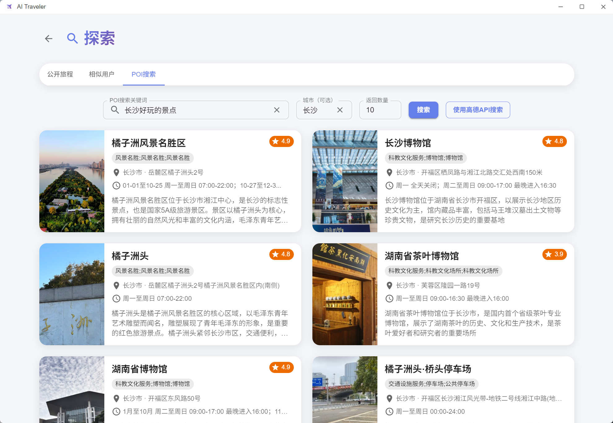
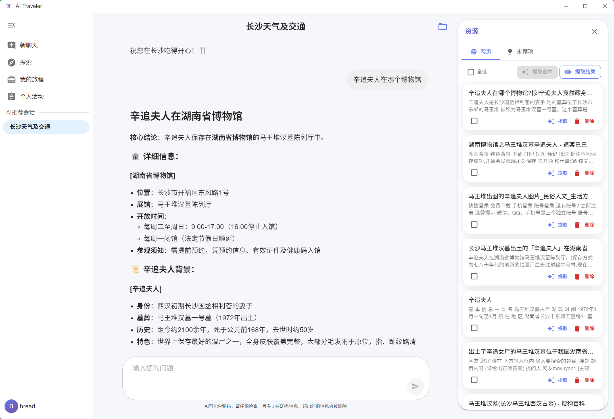
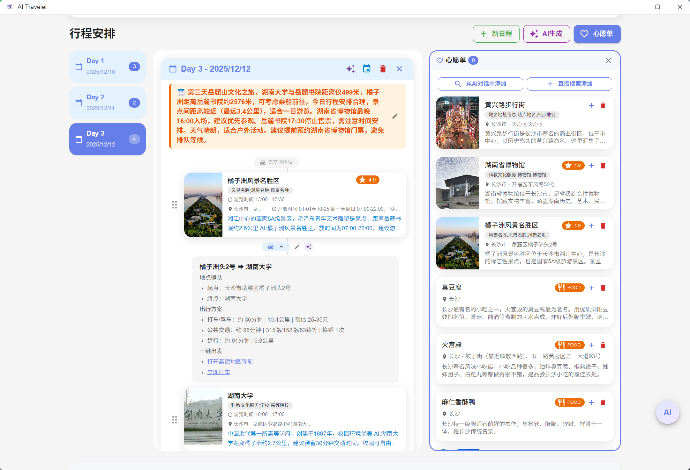
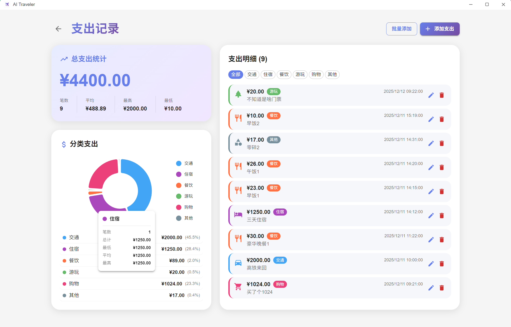

# ✈️ AI Traveler Client (AI 旅游助手)

**AI Traveler** 是一个基于 **Electron + React** 构建的现代化智能旅游助手桌面客户端。它不仅仅是一个简单的行程记录工具，更是一个深度集成了 **LLM (大语言模型)**、**RAG (检索增强生成)** 和 **GIS (地理信息系统)** 的全能旅游规划平台。

通过 AI 赋能，AI Traveler 致力于为用户提供从灵感发现、行程规划到旅途记录的一站式智能化体验。

---

## ✨ 核心功能 (Core Features)

### 🤖 1. 智能探索与发现 (Smart Exploration)
不再为“去哪儿玩”发愁，AI 帮你发现灵感。
*   **公开旅程库**：探索社区用户分享的优质行程，支持按城市、日期筛选，一键申请加入或复制灵感。
*   **兴趣同伴匹配**：基于向量相似度算法，推荐旅行偏好相似的用户 (Similar Users)，寻找你的旅行搭子。
*   **混合 POI 搜索**：
    *   **语义搜索**：支持自然语言描述（如“适合拍照的文艺咖啡馆”），利用向量数据库进行精准匹配。
    *   **API 实时搜索**：集成高德地图 API，获取最新的地点信息。
*   **查看 POI 详情**：查看包括评分、开放时间、平均花费、游玩时长在内的丰富地点详情。
*   **AI聊天对话**：和AI进行对话，探索感兴趣的地点和活动。





### 📅 2. 深度行程规划 (In-Depth Planning)
强大的可视化编辑器，让复杂的行程安排变得井井有条。
*   **拖拽式编排 (Drag & Drop)**：基于 `@dnd-kit` 实现的流畅交互，轻松拖拽调整景点顺序或跨天移动。
*   **AI 交通建议**：AI 自动计算景点间的交通耗时与方式，并支持一键重新规划（AI Replan）。
*   **团队协作**：
    *   **多角色权限**：支持 Owner (所有者)、Editor (编辑者)、Viewer (浏览者) 权限管理。
    *   **实时共享**：邀请好友共同编辑行程，打造完美的团队出游计划。
*   **心愿单集成 (Wishlist)**：侧边栏实时管理待选地点，随时拖入行程中。



### 💰 3. 费用管家 (Expense Manager)
精细化管理每一笔支出，拒绝糊涂账。
*   **可视化图表**：内置 `@mui/x-charts` 饼图，直观展示交通、住宿、餐饮等各分类支出占比。
*   **多维统计**：自动计算总支出、平均消费、最高/最低单笔消费，实时掌握预算情况。
*   **批量记账**：支持一次性录入多笔消费，提升记账效率。
*   **分类管理**：交通、住宿、餐饮、游玩、购物、其他等标准分类。



### 📝 4. 旅程手账 (Trip Journals)
记录旅途中的美好瞬间，生成你的专属游记。
*   **图文混排**：支持上传高清图片（单张≤3MB，总量≤30MB），配合丰富文字记录心情。
*   **隐私控制**：精细的可见性管理，支持“仅自己可见” (私密) 或 “旅程成员可见” (公开)。
*   **沉浸式预览**：内置图片画廊，支持大图预览与切换。


---

## 🛠️ 技术栈 (Tech Stack)

本项目采用业内领先的前端技术栈进行开发，确保了高性能与卓越的用户体验。

| 类别 | 技术组件 | 说明 |
| :--- | :--- | :--- |
| **运行时** | **Electron** | 跨平台桌面应用容器 |
| **核心框架** | **React 18** | 用于构建用户界面的 JavaScript 库 |
| **构建工具** | **Vite** | 极速的前端构建工具 |
| **开发语言** | **TypeScript** | 强类型 JavaScript 超集，保障代码质量 |
| **路由管理** | **React Router 6** | 声明式路由管理 |
| **状态管理** | **Zustand** | 轻量级、高性能的全局状态管理 |
| **数据请求** | **TanStack Query (React Query)** | 强大的异步状态管理与数据缓存 |
| **UI 组件库** | **Material UI (MUI) v5** | 企业级 React UI 组件库 |
| **样式方案** | **Tailwind CSS** | 实用优先 CSS 框架 |
| **图表库** | **MUI X Charts** | 基于 D3 的高性能 React 图表库 |
| **拖拽交互** | **@dnd-kit** | 轻量、模块化的拖拽库 |
| **Markdown** | **React Markdown** | 支持各种插件的 Markdown 渲染 |
| **地图集成** | **@amap/amap-jsapi-loader** | 高德地图 JS API 加载器 |

---

## 📂 项目结构 (Structure)

```tree
client/
├── dist-electron/      # Electron 主进程编译产物
├── electron/           # Electron 主进程源码
│   ├── main/           # 主进程入口 (窗口创建、IPC通信)
│   └── preload/        # 预加载脚本 (ContextBridge)
├── src/                # React 渲染进程源码
│   ├── api/            # API 接口定义 (Axios 封装)
│   ├── assets/         # 静态资源 (图片、图标)
│   ├── components/     # 通用 UI 组件
│   ├── hooks/          # 自定义 Hooks
│   ├── pages/          # 页面级组件
│   │   ├── TripDetailPage.tsx  # 行程详情核心页
│   │   ├── TripExpensesPage.tsx# 费用管理页
│   │   ├── TripLogsPage.tsx    # 旅程日志页
│   │   └── ExplorePage.tsx     # 探索页
│   ├── store/          # Zustand Store (Auth, Trip, etc.)
│   ├── types/          # TypeScript 类型定义
│   ├── utils/          # 工具函数
│   ├── App.tsx         # 应用根组件 (路由配置)
│   └── main.tsx        # 入口文件
├── index.html          # HTML 模板
└── vite.config.ts      # Vite 配置
```

---

## 🚀 快速开始 (Getting Started)

### 环境要求

*   [Node.js](https://nodejs.org/) (Recommended: v18+)
*   [npm](https://www.npmjs.com/) or [yarn](https://yarnpkg.com/)

### 安装与运行

1.  **进入客户端目录**：
    ```bash
    cd client
    ```

2.  **安装依赖**：
    ```bash
    npm install
    ```

3.  **启动开发环境**：
    此命令将同时启动 Vite 开发服务器和 Electron 应用窗口。
    ```bash
    npm run dev
    ```

4.  **构建生产版本**：
    打包生成可执行文件（输出目录位于 `release` 或 `dist`）。
    ```bash
    npm run build
    ```

---

## 🤝 贡献与反馈

欢迎提交 Issue 或 Pull Request 来改进 AI Traveler 客户端。
